# Revisto Evidence Aligned - Architecture Diagrams

## 1. High-Level System Architecture (gRPC Mode with Cloud Elasticsearch)

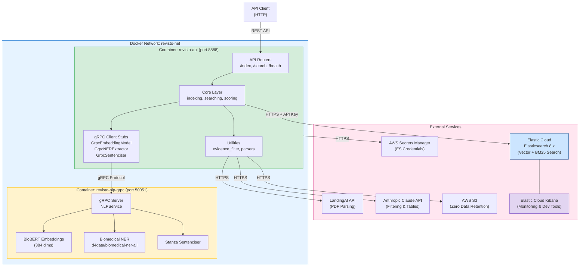

## 2. Indexing Flow

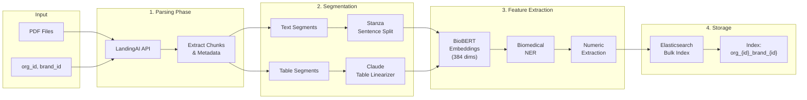

## 3. Search Flow

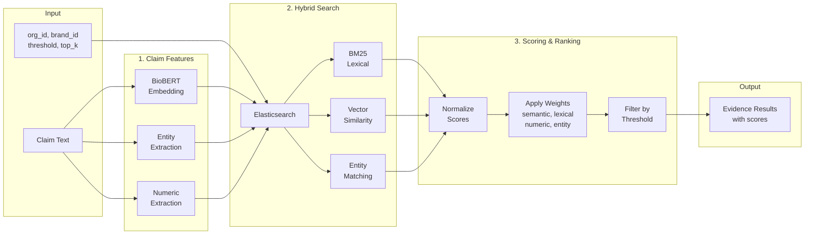

## 4. Deployment Architectures

### 4a. Local Mode (docker-compose.local.yml)

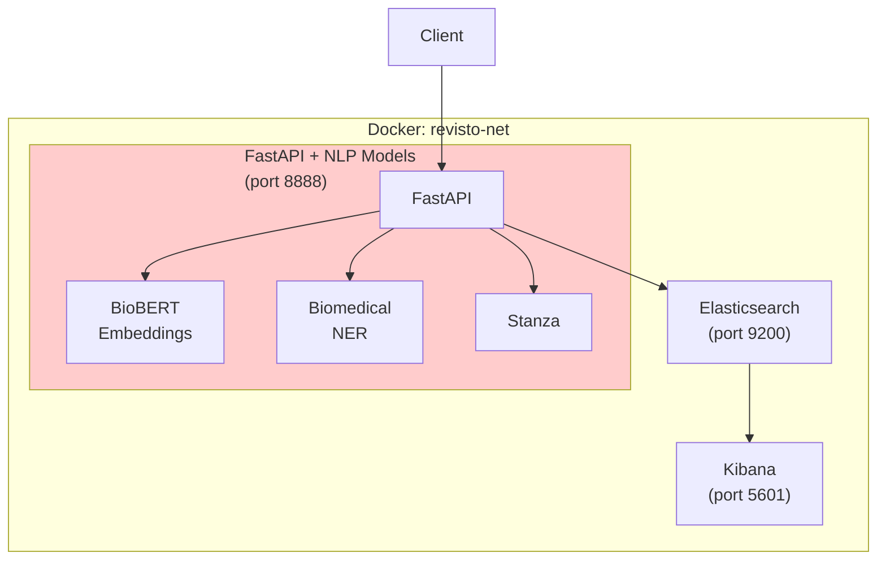

### 4b. gRPC Mode - Local ES (docker-compose.local-grpc.yml)

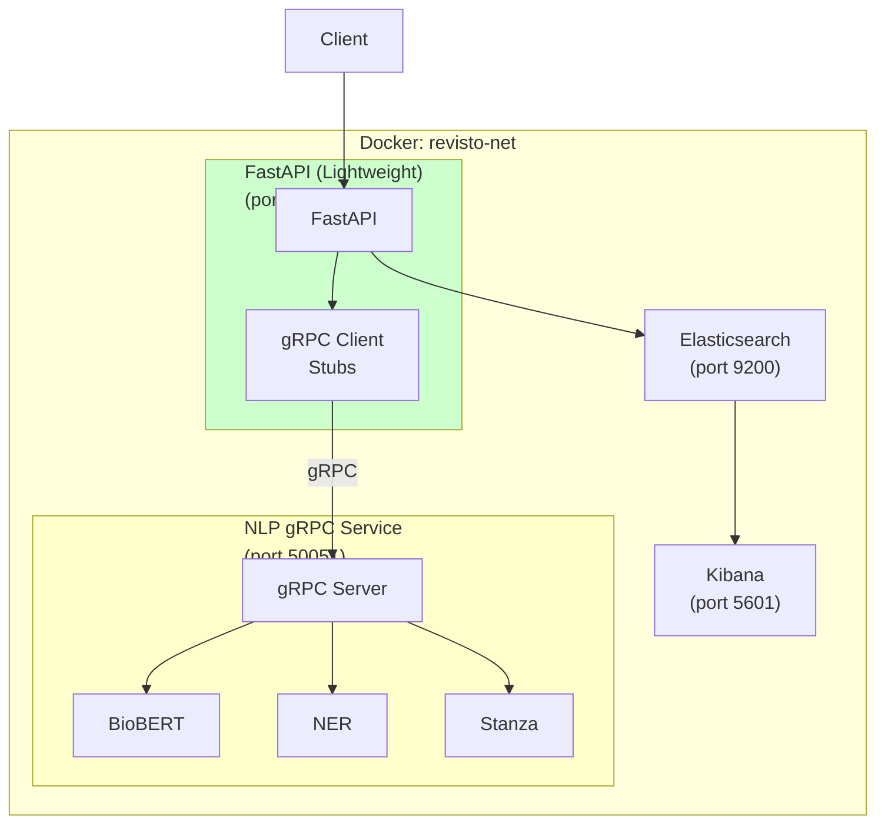

### 4c. gRPC Mode - Cloud ES (docker-compose.grpc.yml)

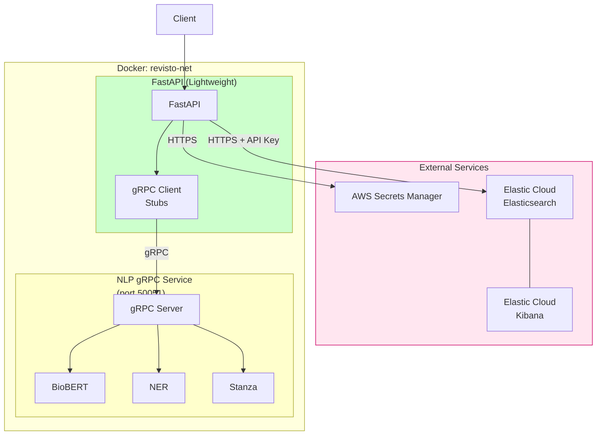

### 4d. Distributed Mode - Independent NLP Service

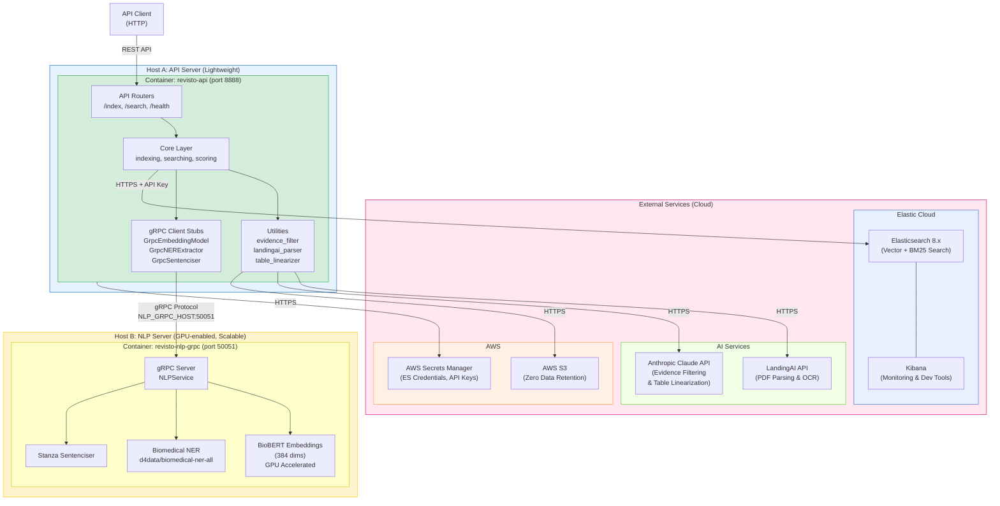

**Data Flow:**

| Flow | Source | Destination | Protocol | Purpose |
|------|--------|-------------|----------|---------|
| 1 | Client | API Server | HTTP/REST | API requests |
| 2 | API Server | NLP Server | gRPC | Embeddings, NER, Sentencization |
| 3 | API Server | Elasticsearch | HTTPS | Index & search operations |
| 4 | API Server | AWS Secrets | HTTPS | Retrieve credentials |
| 5 | API Server | LandingAI | HTTPS | PDF parsing |
| 6 | API Server | Claude API | HTTPS | Evidence filtering, table linearization |
| 7 | API Server | S3 | HTTPS | Zero data retention storage |

**Configuration for Distributed Mode:**

```bash
# ============================================
# Host A: API Server (Lightweight Container)
# ============================================
NLP_MODE=grpc
NLP_GRPC_HOST=<nlp-server-ip-or-hostname>
NLP_GRPC_PORT=50051

# Elasticsearch (credentials from AWS Secrets Manager)
ES_VERIFY_CERTS=true
ES_INDEX=evidence_index

# AWS
AWS_DEFAULT_REGION=us-east-1

# Claude filtering
CLAUDE_FILTER_ENABLED=true
CLAUDE_MODEL=claude-opus-4-20250514

# LandingAI
LANDINGAI_OUTPUT_BUCKET=claimsubstantiation

# ============================================
# Host B: NLP Server (GPU-enabled)
# ============================================
EMBEDDING_MODEL=pritamdeka/BioBERT-mnli-snli-scinli-scitail-mednli-stsb
EMBEDDING_DEVICE=cuda  # GPU acceleration
NER_MODEL=d4data/biomedical-ner-all
NER_ENABLED=true
GRPC_MAX_WORKERS=10
PRELOAD_MODELS=true
```

**Benefits:**

| Benefit | Description |
|---------|-------------|
| **Independent Scaling** | Scale NLP service on GPU instances separately from API |
| **Cost Optimization** | Run API on cheap instances, NLP on GPU only when needed |
| **Resource Isolation** | ML models don't compete with API for memory/CPU |
| **Shared NLP Service** | Multiple API instances can share one NLP service |
| **Multi-Application** | NLP service can serve multiple different applications |
| **Easier Updates** | Update NLP models without redeploying API |

## 5. Component Dependencies

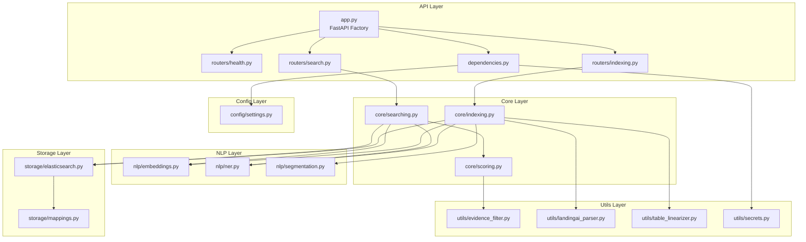

## 6. Data Model (Elasticsearch Document)

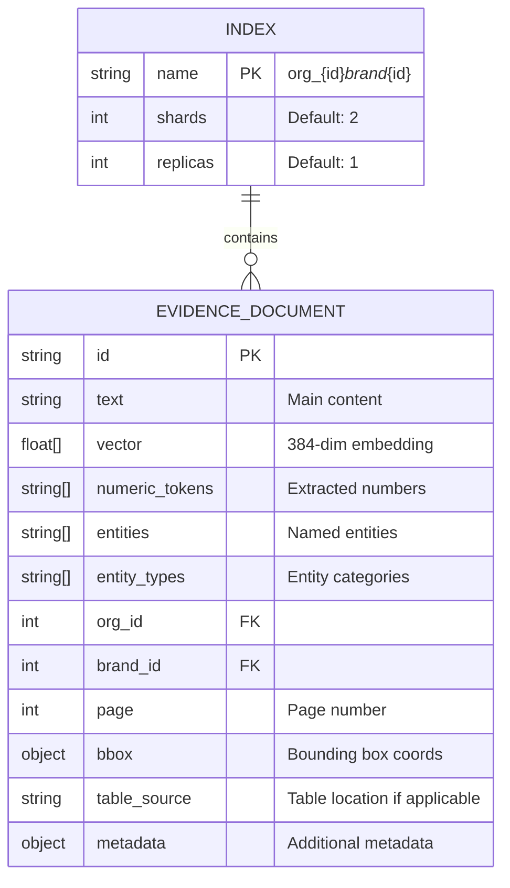

## 7. gRPC Service Definition

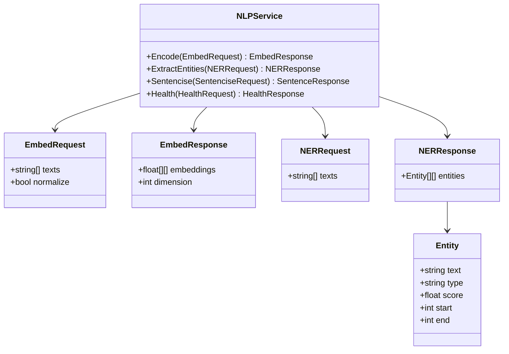

## 8. Scoring Formula

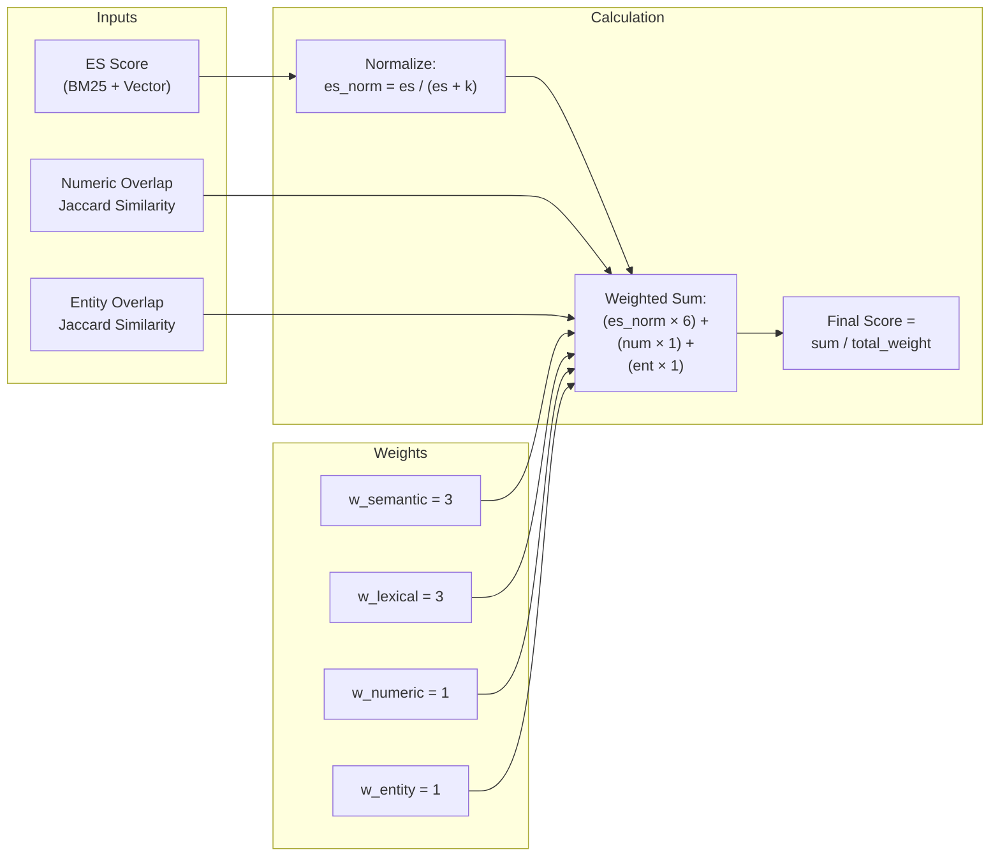

---

## How to Use These Diagrams

### Option 1: Figma
1. Install the "Mermaid to Figma" plugin from Figma Community
2. Copy any mermaid code block above
3. Use the plugin to convert to Figma shapes

### Option 2: Draw.io / Diagrams.net
1. Go to draw.io
2. Click Insert > Advanced > Mermaid
3. Paste the mermaid code

### Option 3: VS Code
1. Install "Markdown Preview Mermaid Support" extension
2. Open this file and preview

### Option 4: Online Renderer
1. Go to https://mermaid.live/
2. Paste the mermaid code to see and export as PNG/SVG

### Option 5: GitHub/GitLab
- Both platforms render Mermaid diagrams natively in markdown files
