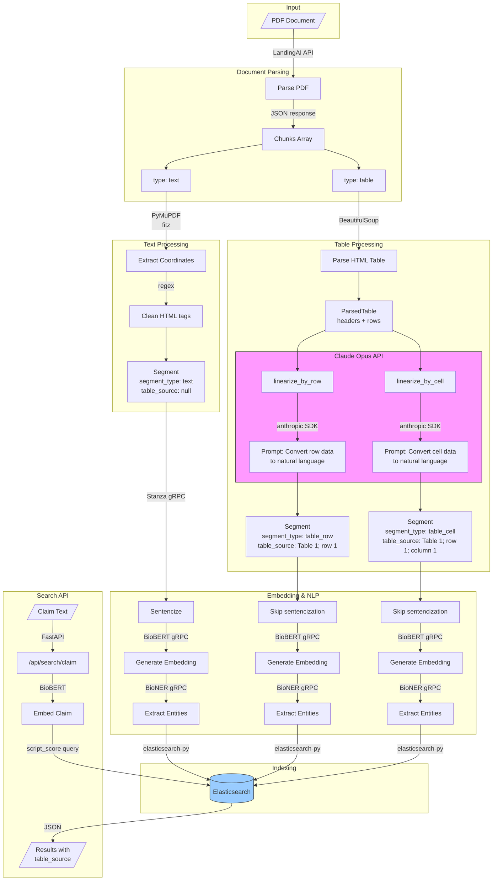
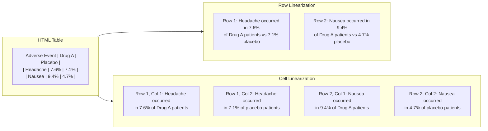

# Table Interpretation Flow

## Overview

This document describes how tables are extracted from PDFs, linearized into natural language, and indexed for semantic search.

## Architecture Diagram



## Table Linearization Example



## Technology Stack

| Step | Tool | Description |
|------|------|-------------|
| PDF Parsing | LandingAI API | Extracts text and table chunks from PDFs |
| HTML Table Parsing | BeautifulSoup | Parses HTML table structure into headers and rows |
| Table Linearization | Claude Opus | Converts table data to natural language statements |
| Sentence Splitting | Stanza (gRPC) | Splits text into sentences |
| Embeddings | BioBERT (gRPC) | Generates semantic embeddings |
| Entity Extraction | BioNER (gRPC) | Extracts biomedical entities |
| Storage & Search | Elasticsearch | Vector search with script_score |
| API | FastAPI | REST API endpoints |

## Data Flow

1. **PDF Input**: Document is uploaded to the indexing endpoint
2. **LandingAI Parsing**: PDF is parsed into chunks (text and tables)
3. **Text Processing**: Text chunks are cleaned and segmented
4. **Table Processing**:
   - HTML tables are parsed with BeautifulSoup
   - Claude generates both row-level and cell-level natural language statements
   - Each statement becomes a separate segment
5. **Embedding**: All segments are embedded using BioBERT
6. **Indexing**: Segments are indexed in Elasticsearch with:
   - `segment_type`: "text", "table_row", or "table_cell"
   - `table_source`: Location reference (e.g., "Table 1; row 1; column 1") or null for text
7. **Search**: Claims are embedded and matched against indexed segments

## Output Fields

```json
{
  "text": "Headache occurred in 7.6% of patients taking Drug A.",
  "segment_type": "table_cell",
  "table_source": "Table 1; row 1; column 1",
  "page": 6,
  "relevance_score": 0.85
}
```
